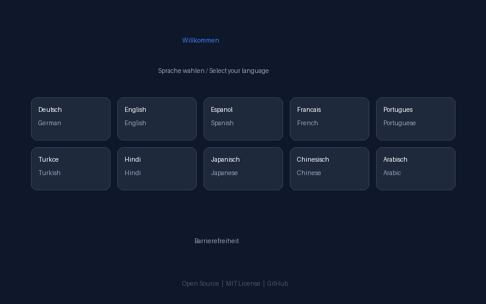
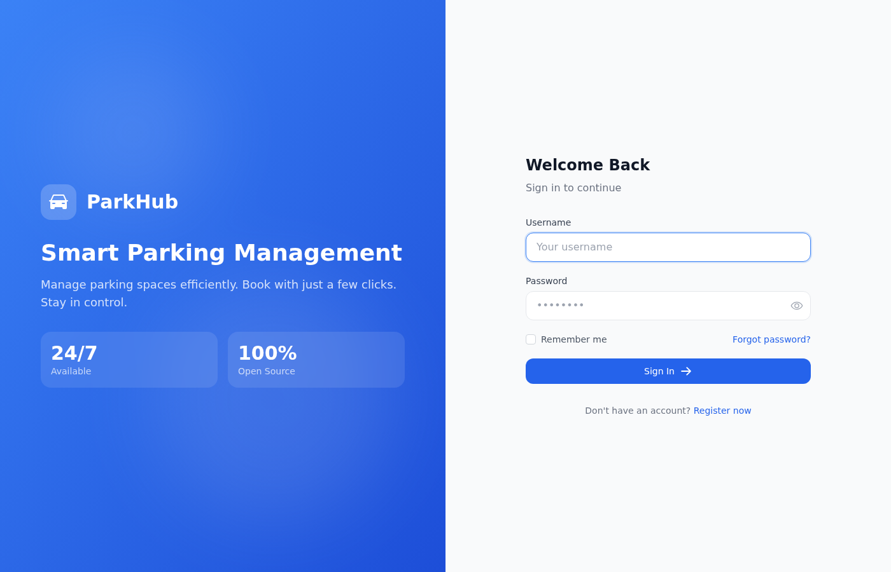
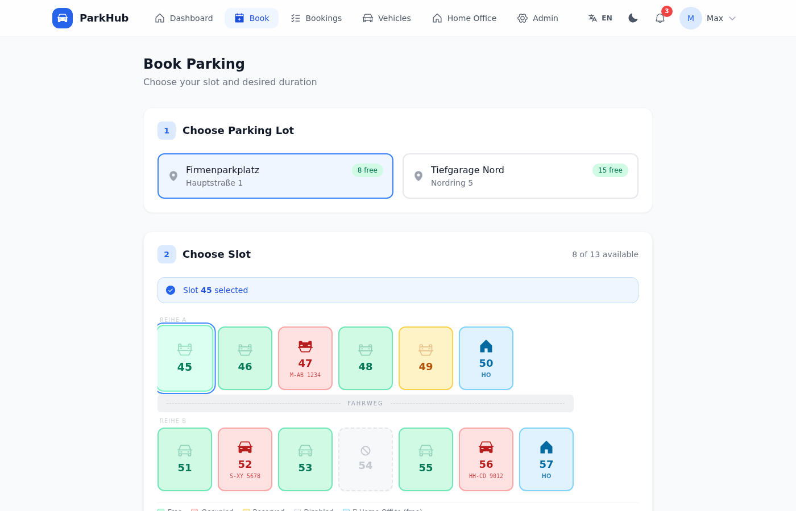
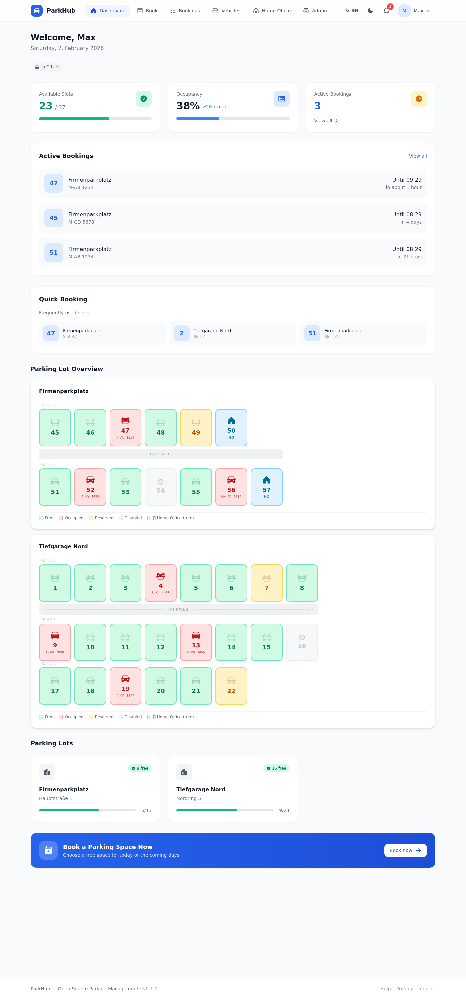
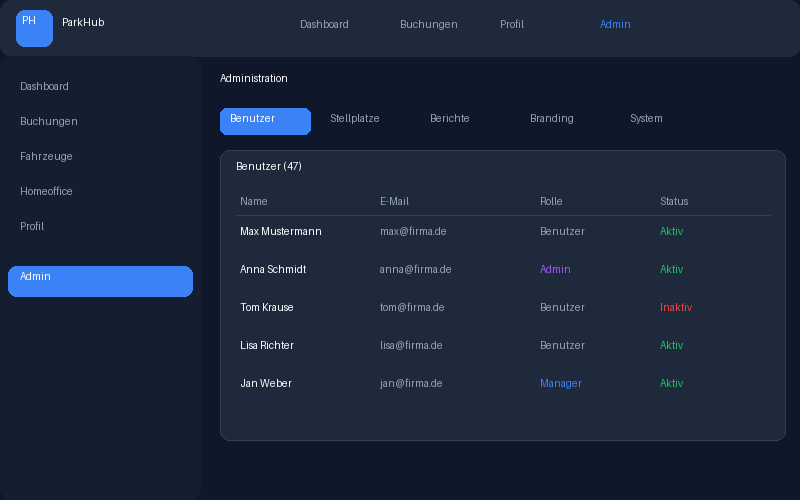
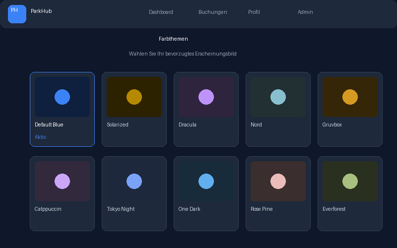
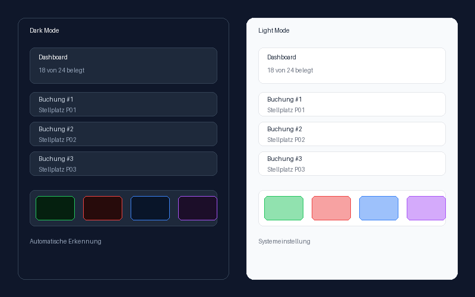
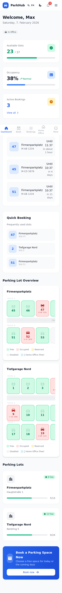

<p align="center">
  
</p>

<h1 align="center">ParkHub</h1>

<p align="center">
  <strong>Open-source parking management for everyone. One binary. Zero dependencies. Beautiful UI.</strong>
</p>

<p align="center">
  <a href="LICENSE"></a>
  <a href="https://www.rust-lang.org/"></a>
  <a href="https://www.typescriptlang.org/"></a>
  <a href="https://hub.docker.com/r/nash87/parkhub"></a>
</p>

<p align="center">
  <a href="docs/INSTALLATION.md">Installation</a> · <a href="docs/API.md">API Docs</a> · <a href="docs/CONFIGURATION.md">Configuration</a> · <a href="docs/DEPLOYMENT.md">Deployment</a> · <a href="docs/DEVELOPMENT.md">Development</a> · <a href="CONTRIBUTING.md">Contributing</a>
</p>

---

ParkHub is a self-hosted parking management system for everyone — companies, residential buildings, families, rental properties, and public facilities. It ships as a single binary with an embedded database — no PostgreSQL, no Redis, no external services. Drop it on a server and it runs.

## Key Features

ParkHub supports 5 use-case modes: **Corporate**, **Residential**, **Family**, **Rental**, and **Public** — each with tailored labels and terminology.


| Feature | Description |
|---|---|
| **Real-time Slot Management** | Interactive visual parking map with live availability |
| **Smart Booking System** | One-time, multi-day, and permanent reservations with check-in & QR codes |
| **10 Color Themes** | Solarized, Dracula, Nord, Gruvbox, Catppuccin, Tokyo Night, One Dark, Rose Pine, Everforest, Default Blue |
| **Dark / Light Mode** | Full dark theme with automatic system detection |
| **Internationalization** | 10 languages: English, German, Spanish, French, Portuguese, Turkish, Arabic, Hindi, Japanese, Chinese |
| **Accessibility** | Colorblind modes (protanopia, deuteranopia, tritanopia), font scaling, reduced motion, high contrast |
| **Branding & Customization** | Custom logo, colors, and organization name via admin panel |
| **Homeoffice Integration** | Set WFH patterns, auto-release parking spots for others |
| **GDPR / DSGVO** | Data export, account deletion, privacy policy — fully compliant |
| **PWA-Ready** | Install as native app on any device |
| **Single Binary** | ~30 MB, embedded redb database, zero external dependencies |
| **REST API** | Full API with Swagger/OpenAPI documentation |
| **iCal Export** | Subscribe to your bookings in any calendar app |
| **Admin Dashboard** | Reports, statistics, CSV export, user management |
| **Waitlist System** | Automatic notification when a spot becomes available |
| **Welcome Screen** | Guided first-run experience with language selection |
| **Auto-Onboarding Wizard** | Step-by-step setup: password, use-case, organization, dummy data, registration mode |
| **Vehicle Management** | Add vehicles with autocomplete (50+ brands), German license plate format (XX-YY 1234), photo upload with auto-resize |
| **Booking Date/Time** | Select specific date and time range for bookings |
| **Slot Favorites** | Mark preferred parking slots for quick booking |
| **Rate Limiting** | Built-in request throttling per IP and per user |
| **Security Hardened** | XSS prevention, input validation, HSTS, security headers |

## Quick Start

```bash
# Interactive installer (Linux / macOS)
curl -fsSL https://raw.githubusercontent.com/nash87/parkhub/main/install.sh | bash

# Windows (PowerShell)
irm https://raw.githubusercontent.com/nash87/parkhub/main/install.ps1 | iex
```

The installer offers two modes:

- **Quick Start** — Default settings, ready in 2 minutes. Detects your IP and shows the access URL.
- **Custom Installation** — Configure port, TLS, admin credentials, use-case type, organization name, and more.

After installation, open the displayed URL to start the **onboarding wizard**.

Default port is **7878**. An admin account (`admin` / `admin`) is created on first start. Change the password immediately.

On first start, a welcome screen lets you choose your language. Then an onboarding wizard guides you through setup: password change, use-case selection, organization name, and configuration options.

## Screenshots

<p align="center">
  
  &nbsp;&nbsp;
  
</p>

<p align="center">
  
  &nbsp;&nbsp;
  
</p>

<p align="center">
  
  &nbsp;&nbsp;
  
</p>

<details>
<summary>More screenshots / Weitere Screenshots</summary>
<br>
<p align="center">
  
  &nbsp;&nbsp;
  
</p>
</details>


## Installation

### Binary

```bash
# Linux / macOS
curl -fsSL https://raw.githubusercontent.com/nash87/parkhub/main/install.sh | bash

# Windows (PowerShell)
irm https://raw.githubusercontent.com/nash87/parkhub/main/install.ps1 | iex
```

### Docker

```bash
docker run -d \
  --name parkhub \
  -p 7878:7878 \
  -v parkhub-data:/data \
  ghcr.io/nash87/parkhub:latest
```

### From Source

```bash
git clone https://github.com/nash87/parkhub.git
cd parkhub

# Build frontend
cd parkhub-web && npm ci && npm run build && cd ..

# Build server (use --features headless for server-only, no GUI)
cargo build --release --package parkhub-server --no-default-features --features headless

# Run
./target/release/parkhub-server
```

See the full [Installation Guide](docs/INSTALLATION.md) for Docker Compose, Kubernetes, reverse proxy, systemd, and TLS setup.

## Configuration

ParkHub works out of the box with sensible defaults. For customization, create a `config.toml`:

```toml
[server]
port = 7878
data_dir = "/var/lib/parkhub"

[tls]
enabled = false
cert = "/etc/parkhub/cert.pem"
key = "/etc/parkhub/key.pem"

[smtp]
enabled = false
host = "smtp.example.com"
from = "parking@example.com"

[rate_limit]
requests_per_minute = 60
```

See [Configuration Reference](docs/CONFIGURATION.md) for all options.

## API Overview

All endpoints are under `/api/v1/`. Authentication uses Bearer tokens.

| Method | Endpoint | Description |
|--------|----------|-------------|
| `POST` | `/auth/login` | Authenticate and receive tokens |
| `POST` | `/auth/register` | Create new account |
| `GET` | `/lots` | List parking lots |
| `GET` | `/lots/:id/slots` | Get slots for a lot |
| `POST` | `/bookings` | Create a booking |
| `GET` | `/bookings/ical` | Export bookings as iCal |
| `POST` | `/bookings/:id/checkin` | Check in to booking |
| `GET` | `/vehicles` | List user vehicles |
| `GET/PUT` | `/homeoffice` | Manage homeoffice settings |
| `GET` | `/admin/stats` | Dashboard statistics |
| `GET` | `/admin/reports` | Generate reports |
| `GET` | `/users/me/export` | GDPR data export |
| `DELETE` | `/users/me/delete` | GDPR account deletion |

See the full [API Documentation](docs/API.md) for all 40+ endpoints with examples.

## Architecture

```
┌──────────────────────────────────────────────────────────┐
│                        Browser                           │
│              React · TypeScript · TailwindCSS             │
└────────────────────────┬─────────────────────────────────┘
                         │ HTTPS
┌────────────────────────┴─────────────────────────────────┐
│              Reverse Proxy (Nginx / Caddy)                │
│                    TLS termination                        │
└────────────────────────┬─────────────────────────────────┘
                         │ HTTP
┌────────────────────────┴─────────────────────────────────┐
│                    ParkHub Server                         │
│         Rust · Axum · Tower (rate limiting)               │
│                                                          │
│  ┌─────────┐  ┌──────────┐  ┌─────────┐  ┌───────────┐  │
│  │  Auth   │  │ Bookings │  │  Admin  │  │  Metrics  │  │
│  │  Token  │  │  iCal    │  │ Reports │  │ Prometheus│  │
│  └─────────┘  └──────────┘  └─────────┘  └───────────┘  │
│                                                          │
│  ┌─────────────────────────────────────────────────────┐  │
│  │                  redb (embedded)                    │  │
│  │            Zero-config · ACID · Fast                │  │
│  └─────────────────────────────────────────────────────┘  │
└──────────────────────────────────────────────────────────┘
```

## Tech Stack

| Layer | Technology |
|-------|-----------|
| Backend | Rust 1.83+, Axum, Tower, Tokio |
| Database | redb (embedded key-value store) |
| Frontend | React 18, TypeScript 5, TailwindCSS 3 |
| Animations | Framer Motion |
| Icons | Phosphor Icons |
| Build | Vite, Cargo |
| Container | Docker (multi-stage, ~20 MB image) |
| CI/CD | GitHub Actions |

## Contributing

Contributions welcome. See [CONTRIBUTING.md](CONTRIBUTING.md) for guidelines and the PR process.

## License

ParkHub is licensed under the [MIT License](LICENSE).

---

<p align="center">
  <a href="docs/INSTALLATION.md">Installation</a> · <a href="docs/API.md">API</a> · <a href="docs/CONFIGURATION.md">Config</a> · <a href="docs/DEPLOYMENT.md">Deploy</a> · <a href="docs/DEVELOPMENT.md">Develop</a> · <a href="docs/THEMES.md">Themes</a> · <a href="docs/SECURITY.md">Security</a> · <a href="docs/ACCESSIBILITY.md">Accessibility</a>
</p>
