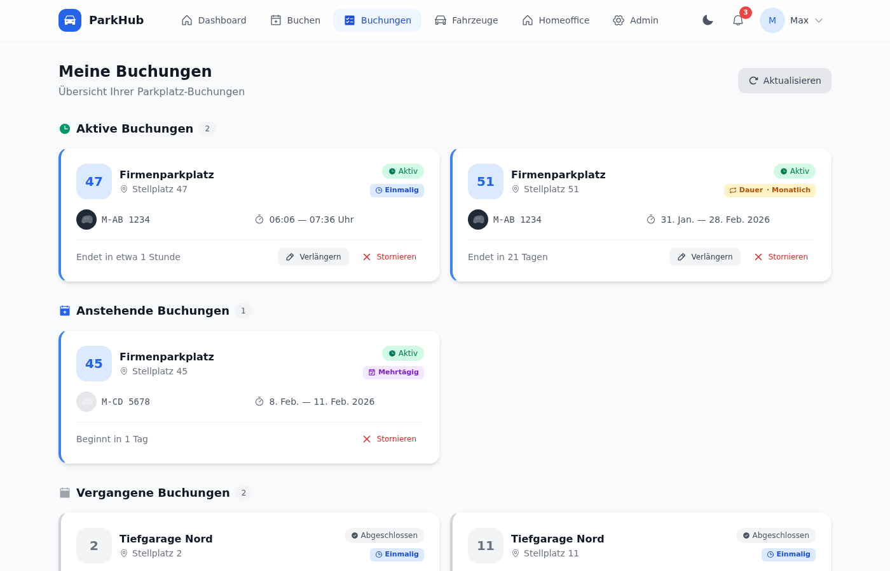
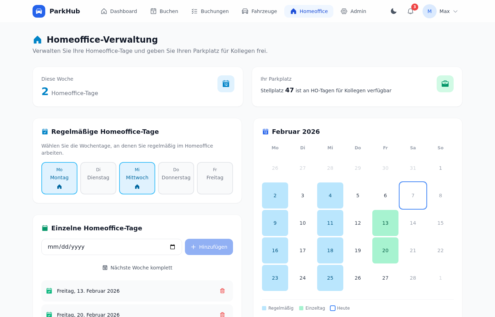
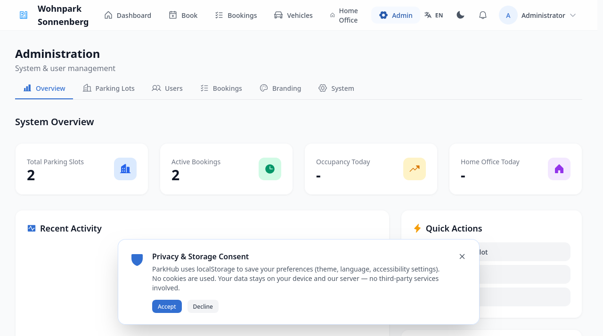
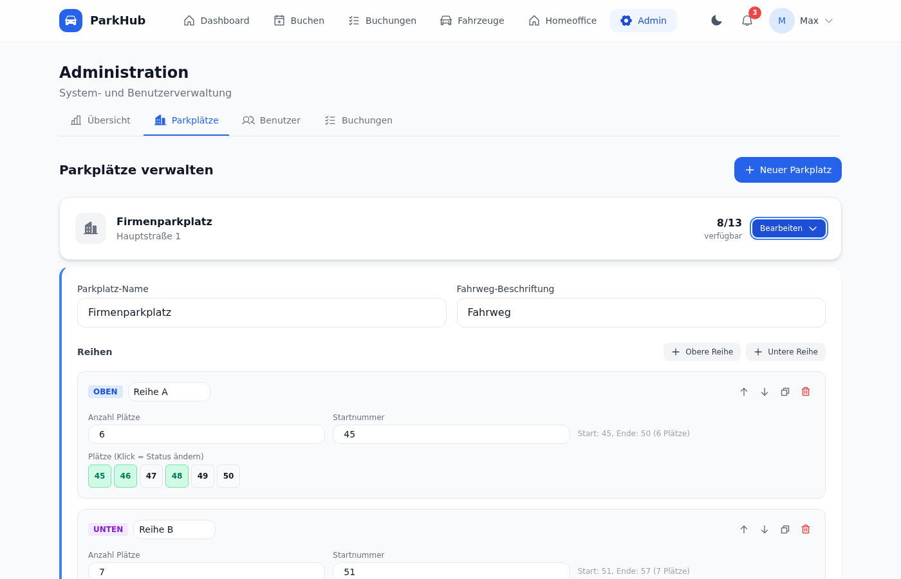

# 🅿️ ParkHub

**Open-source parking management for companies.** Simple. Self-hosted. Zero dependencies.

One binary. Embedded database. Modern web UI. Just start and go.

<!-- Screenshot placeholder -->

---

## ✨ Features

### For Employees
- 📅 **Smart Booking** — Book parking spots: one-time, multi-day, or permanent
- 🗺️ **Visual Parking Map** — Interactive top-down grid with real-time availability
- 🏠 **Home Office Integration** — Set home office days, auto-release your spot for colleagues
- 🚗 **Vehicle Management** — Register vehicles with photos for easy identification
- 🔔 **Notifications** — Get reminded before your booking expires
- 📱 **PWA** — Install as app on any device

### For Admins
- ⚙️ **Lot Designer** — Visual editor to configure parking lots, rows, and slots
- 👥 **User Management** — Roles, permissions, account status
- 📊 **Dashboard** — Real-time occupancy, statistics, activity log
- 📋 **Booking Overview** — Filter, search, bulk actions across all users

### Technical
- 🦀 **Rust Backend** — Fast, safe, single binary (~30MB)
- ⚡ **Embedded Database** — redb, no PostgreSQL/MySQL needed
- 🌐 **React Frontend** — TypeScript, Tailwind CSS, Framer Motion
- 🌍 **i18n** — German & English (extensible)
- 🌙 **Dark Mode** — Full dark theme support
- 🐳 **Docker Ready** — Multi-stage build, ~20MB image
- 📡 **REST API** — Swagger/OpenAPI documented

---

## 🚀 Quick Start

### Docker (Recommended)
```bash
docker run -d \
  --name parkhub \
  -p 8080:8080 \
  -v parkhub-data:/data \
  ghcr.io/nash87/parkhub:latest
```
Open http://localhost:8080 — done!


> ⚠️ **Default credentials: `admin` / `admin` — Change your admin password immediately after first login!**


### Docker Compose
```bash
git clone https://github.com/nash87/parkhub.git
cd parkhub
docker compose up -d
```

### One-Liner Install

```bash
# Linux/macOS
curl -fsSL https://raw.githubusercontent.com/nash87/parkhub/main/install.sh | bash

# Windows (PowerShell)
irm https://raw.githubusercontent.com/nash87/parkhub/main/install.ps1 | iex
```

### Binary (Manual)
Download from [Releases](https://github.com/nash87/parkhub/releases):

| Platform | Download |
|---|---|
| Linux x86_64 | `parkhub-linux-x86_64.tar.gz` |
| Linux aarch64 | `parkhub-linux-aarch64.tar.gz` |
| macOS x86_64 | `parkhub-macos-x86_64.tar.gz` |
| macOS Apple Silicon | `parkhub-macos-aarch64.tar.gz` |
| Windows x86_64 | `parkhub-windows-x86_64.zip` |

```bash
# Linux/macOS
tar xzf parkhub-*.tar.gz
chmod +x parkhub-server
./parkhub-server

# Windows
# Extract zip, then run parkhub-server.exe
```
Data is stored in `./parkhub-data/` (portable) or system dirs.

---

## 🔧 Configuration

### Environment Variables
| Variable | Default | Description |
|---|---|---|
| `PARKHUB_HOST` | `0.0.0.0` | Listen address |
| `PARKHUB_PORT` | `8080` | Listen port |
| `PARKHUB_DATA_DIR` | `./parkhub-data` | Data directory |
| `PARKHUB_ADMIN_USER` | `admin` | Initial admin username |
| `PARKHUB_ADMIN_PASS` | `admin` | Initial admin password |
| `PARKHUB_TLS_ENABLED` | `false` | Enable HTTPS |
| `PARKHUB_TLS_CERT` | — | TLS certificate path |
| `PARKHUB_TLS_KEY` | — | TLS private key path |
| `PARKHUB_SMTP_HOST` | — | SMTP server hostname |
| `PARKHUB_SMTP_PORT` | `587` | SMTP server port |
| `PARKHUB_SMTP_USER` | — | SMTP username |
| `PARKHUB_SMTP_PASS` | — | SMTP password |
| `PARKHUB_SMTP_FROM` | — | Sender email address |
| `PARKHUB_AUTO_RELEASE_MINUTES` | `30` | Auto-release unconfirmed bookings after N minutes |
| `PARKHUB_VAPID_PRIVATE_KEY` | — | VAPID private key for push notifications |
| `PARKHUB_VAPID_PUBLIC_KEY` | — | VAPID public key for push notifications |
| `RUST_LOG` | `info` | Log level |

### config.toml
```toml
[server]
name = "Company Parking"
port = 8080

[auth]
jwt_secret = "change-me"
session_duration = "24h"

[features]
homeoffice = true
vehicle_photos = true
multi_day_booking = true
```

---

## 📱 PWA Installation (Add to Home Screen)

ParkHub is a Progressive Web App — install it for a native app experience:

**iOS (Safari):**
1. Open ParkHub in Safari
2. Tap the Share button (↑)
3. Scroll down and tap **"Add to Home Screen"**
4. Tap **Add**

**Android (Chrome):**
1. Open ParkHub in Chrome
2. Tap the three-dot menu (⋮)
3. Tap **"Add to Home Screen"** or **"Install app"**
4. Confirm

**Desktop (Chrome/Edge):**
1. Open ParkHub in your browser
2. Click the install icon (⊕) in the address bar
3. Click **Install**

---

## 🐧 Systemd Service (Permanent Installation)

For running ParkHub as a system service on Linux:

```ini
[Unit]
Description=ParkHub - Parking Management
After=network.target

[Service]
Type=simple
User=parkhub
Group=parkhub
ExecStart=/usr/local/bin/parkhub-server
WorkingDirectory=/var/lib/parkhub
Environment=PARKHUB_DATA_DIR=/var/lib/parkhub
Environment=PARKHUB_PORT=8080
Environment=RUST_LOG=info
Restart=on-failure
RestartSec=5

[Install]
WantedBy=multi-user.target
```

```bash
# Create user and data directory
sudo useradd -r -s /usr/sbin/nologin -d /var/lib/parkhub parkhub
sudo mkdir -p /var/lib/parkhub
sudo chown parkhub:parkhub /var/lib/parkhub

# Install service
sudo cp parkhub.service /etc/systemd/system/
sudo systemctl daemon-reload
sudo systemctl enable --now parkhub

# Check status
sudo systemctl status parkhub
sudo journalctl -u parkhub -f
```

> 💡 **Tip:** The install script (`install.sh`) can set this up automatically!

---

## 🔄 Upgrading

ParkHub stores all data in the data directory (default: `./parkhub-data/`). Upgrading is simple:

1. **Stop** the running instance
2. **Replace** the binary with the new version
3. **Start** again — data persists automatically

```bash
# If using systemd
sudo systemctl stop parkhub
curl -fsSL https://raw.githubusercontent.com/nash87/parkhub/main/install.sh | bash
sudo systemctl start parkhub

# If using Docker
docker pull ghcr.io/nash87/parkhub:latest
docker compose up -d
```

> ✅ Database migrations run automatically on startup. No manual steps needed.

---

## 🏗️ Building from Source

### Prerequisites
- Rust 1.75+
- Node.js 20+
- npm

### Build
```bash
# Clone
git clone https://github.com/nash87/parkhub.git
cd parkhub

# Build frontend
cd parkhub-web && npm install && npm run build && cd ..

# Build backend (embeds frontend)
cargo build --release

# Binary at target/release/parkhub-server
```

---

## 📖 API

REST API at `/api/v1/`:

| Method | Endpoint | Description |
|---|---|---|
| POST | /api/v1/auth/login | Login |
| POST | /api/v1/auth/register | Register |
| GET | /api/v1/users/me | Current user |
| GET | /api/v1/lots | List parking lots |
| GET | /api/v1/lots/:id | Lot details with layout |
| GET | /api/v1/lots/:id/slots | Slots with status |
| GET | /api/v1/bookings | My bookings |
| POST | /api/v1/bookings | Create booking |
| DELETE | /api/v1/bookings/:id | Cancel booking |
| GET | /api/v1/vehicles | My vehicles |
| POST | /api/v1/vehicles | Add vehicle |
| POST | /api/v1/vehicles/:id/photo | Upload photo |
| GET | /api/v1/homeoffice | HO settings |
| PUT | /api/v1/homeoffice/pattern | Update HO pattern |
| GET | /api/v1/admin/users | List users (admin) |
| GET | /api/v1/admin/bookings | All bookings (admin) |

Full OpenAPI spec at `/swagger-ui/` when running. Raw JSON at `/api-docs/openapi.json`.

---

## 🐳 Kubernetes / Helm

```yaml
apiVersion: apps/v1
kind: Deployment
metadata:
  name: parkhub
spec:
  replicas: 1
  selector:
    matchLabels:
      app: parkhub
  template:
    metadata:
      labels:
        app: parkhub
    spec:
      containers:
        - name: parkhub
          image: ghcr.io/nash87/parkhub:latest
          ports:
            - containerPort: 8080
          env:
            - name: PARKHUB_ADMIN_PASS
              valueFrom:
                secretKeyRef:
                  name: parkhub-secrets
                  key: admin-password
          volumeMounts:
            - name: data
              mountPath: /data
      volumes:
        - name: data
          persistentVolumeClaim:
            claimName: parkhub-data
```

---

## 📸 Screenshots

<details>
<summary>Click to expand screenshots</summary>

### Dashboard


### Book a Parking Spot


### My Bookings


### Home Office Management


### Admin Overview


### Admin Lot Editor


### Login


### Mobile View


</details>

---

## 🤝 Contributing

Contributions welcome! See [CONTRIBUTING.md](CONTRIBUTING.md).

1. Fork the repo
2. Create your feature branch (`git checkout -b feat/amazing-feature`)
3. Commit (`git commit -m 'feat: add amazing feature'`)
4. Push (`git push origin feat/amazing-feature`)
5. Open a Pull Request

---

## 📄 License

MIT — see [LICENSE](LICENSE) for details.

---

**Made with 🦀 Rust + ⚛️ React**
